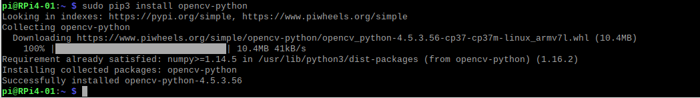
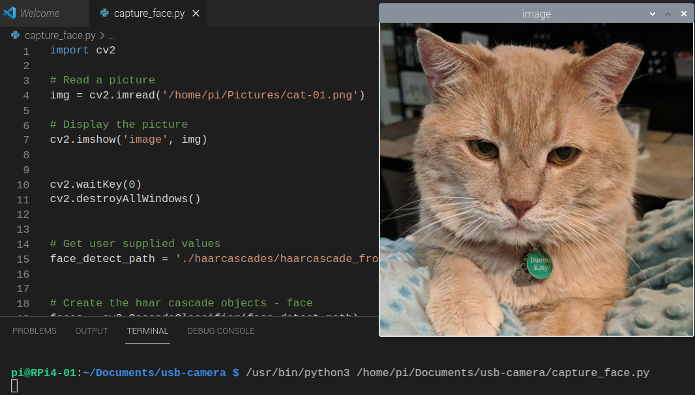
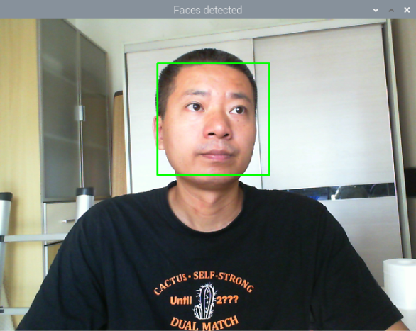
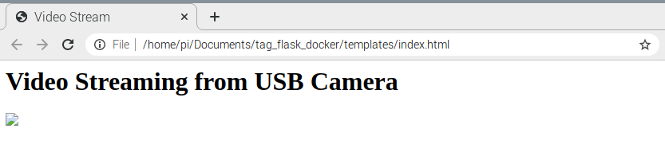
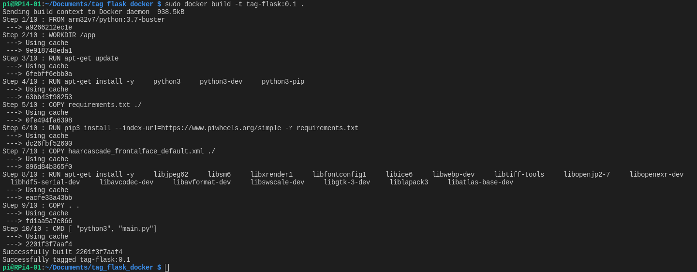
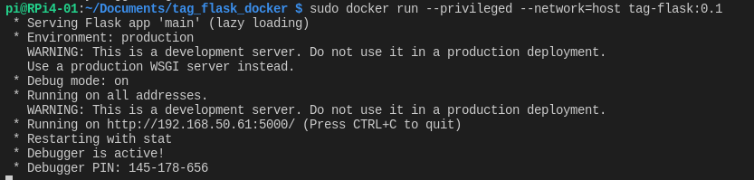
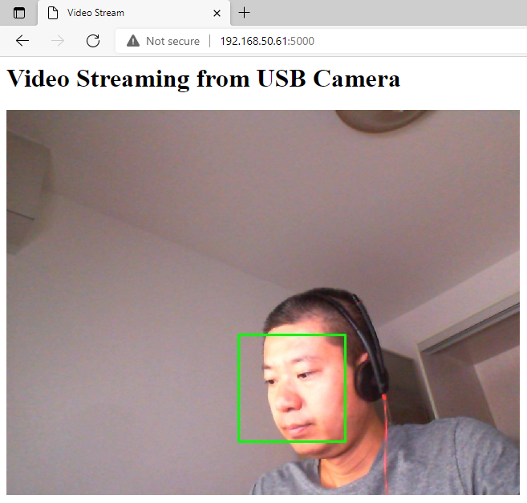

# Readme

This article is to use OpenCV and Haarcascades to detect and recognize faces on Edge.


# Prerequisities

## Hardware
- RPI 4B+ with Raspberry Pi OS Buster ARM32v7
- USB Camera
  
  The USB camera shall work on Linux. Suggest to use Microsoft USB camera LifeCam Cinema.

   

## Install OpenCV on RPI4

Run command from terminal:

`pip3 install opencv-python`

 


# Step 1: Load an image and display

- Prepare a photo like cat picture and save it to the `~/Pictures` folder.
- Use imread() method to load the picture
- Use imshow() method to display the image

```
import cv2

# Read a picture
img = cv2.imread('/home/pi/Pictures/cat-01.png')

# Display the picture
cv2.imshow('image', img)

cv2.waitKey(0)
cv2.destroyAllWindows()
```

 


# Step 2: Capture a video stream

## 2.1 Read video stream

- Connect USB camera to your RPI4
- Run command `lsusb` to verify the USB camera.
- Open the camera video mode

```
# Open the device at ID 0
cap = cv2.VideoCapture(0)

# Check whether the selected camera is opened
if not (cap.isOpened()):
   print("Failed to open video source")
```

## 2.2 Set the resolution of the camera

Use `cap.set()` method to set the resolution.


```
# Set the resolution of the camera
cap.set(3, 640)
cap.set(4, 480)
```

You may define a few methods to set the resolutions. For examples:

```
import cv2

# Define two methods to adjust resolution
def make_720p():
    cap.set(3, 1280)
    cap.set(4, 720)

def make_480p():
    cap.set(3, 640)
    cap.set(4, 480)

def change_res(width, height):
    cap.set(3, width)
    cap.set(4, height)

# Set the resolution to 480p
make_480p()
```

## 2.3 Grab the frame and show it in the window

Use method cap.read() to capture frame-by-frame.

```
ret, frame = cap.read() 
```

Display the resulting frame
```
cv2.imshow('Video', frame)
if cv2.waitkey() & 0xff == ord('q'):
   break
```

## 2.4 Release the capture

Use below codes:

```
cap.release()
cv2.destroyAllWindows()
```

The captured video stream is like this:




# Step 3: Take picture with USB camera

In this samle, you may use USB camera to take a picture and save it to a local file.

## 3.1 Create a function to take picture

The codes are something like below.

- cv2.imshow() method is to show the image.
- cv2.imwrite() method is to save the image to a specified file.

```
import cv2
import time

cap = cv2.VideoCapture(0)

if not (cap.isOpened()):
    print('Failed to open device')
    exit()

ret, frame = cap.read()

def take_picture():
    (grabbed, frame) = cap.read()
    cv2.imshow('Image1', frame)
    cv2.waitKey(1)
    time.sleep(0.5)
    image = '/home/pi/Pictures/image.png'
    cv2.imwrite(image, frame)
    cap.release()
    return image
```

## 3.2 Call the function

```
imageCaptured = take_picture()
```

## 3.3 Load the captured image and display

This part is included in the function.
```
    image = '/home/pi/Pictures/image.png'
    cv2.imwrite(image, frame)
    cap.release()
```

The picture taken will be displayed.


# Step 4: Create a docker

## 4.1: Create a Dockerfile

The sample Dockerfile can be found from [HERE](sources/Dockerfile).

Please be noted:
- Try to use `python:3.7-buster` instead of `python3.7-slim-buster`.
- Try to use `https://www.piwheels.org/simple` while downloading dependencies defined in requirements.txt
- You should copy the face detect algorithm: `COPY haarcascade_frontalface_default.xml ./`
- Below dependencies are required to run opencv in a container.
    ```
    #Install other dependencies
    RUN apt-get install -y \
        libjpeg62 \
        libsm6 \
        libxrender1 \
        libfontconfig1 \
        libice6 \
        libwebp-dev \
        libtiff-tools \
        libopenjp2-7 \
        libopenexr-dev \
        libhdf5-serial-dev \
        libavcodec-dev \
        libavformat-dev \
        libswscale-dev \
        libgtk-3-dev \
        liblapack3 \
        libatlas-base-dev
    ```


## 4.2: Create a requirement.txt file

This file can be found from [HERE](sources/requirements.txt).

The dependencies are to be installed.

```
opencv-python
numpy
cmake
flask
```

## 4.3: Create templates/index.html

The sample index.html file can be found [HERE](sources/Lab4/templates/index.html)



Please be noted the file structure. `index.html` need to be put in the folder `templates`.

## 4.4: Docker build the app into an image

Run below command:

```
sudo docker build -t tag-flask:0.1 .
```




## 4.5: Docker run the image

Run below command:

```
sudo docker run --privileged --network=host tag-flask:0.1
```

Here you should set the network mode to `host` so it can be viewed remotely.




# Step 5: View the tagged stream from browser

Open a browser and type `http://192.168.50.61:5000`.



The complete source code can be found from [HERE](sources/main.py).

[THE END]


